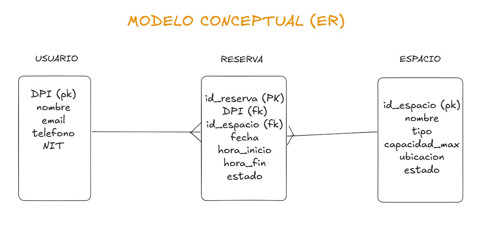
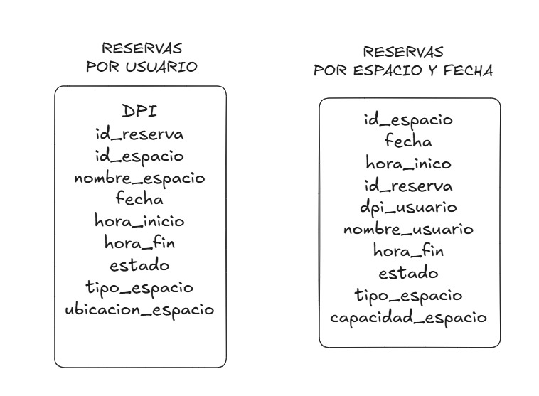

# <div align="center">  Proyecto #1 - Grupo 2 </div>

## <div align="center">  Laboratorio Sistemas de Bases de Datos 2 - Sección A </div>
## <div align="center">  Primer Semestre 2025 </div> 
___

## Miembros

| Nombre | Carnet |
|:------:|:------:|
| Julio Alejandro Zaldaña Ríos | 202110206 |
| Edgar Mauricio Gómez Flores | 2011-14340 |
| Edgar Rolando Alvarez Rodriguez  | 202001144 |

______

## <div align="center">  Fases de Desarrollo </div> 

### Modelo Conceptual (Entidad-Relación)

3 entidades principales:

1. Usuario
2. Reserva
3. Espacio

Se realizan las relaciones entre tablas, como un modelo relacional.




### Modelo Lógico

Se aplica desnormalización en el modelo anterior, para evitar:

* Evitar JOINS
* Normalización excesiva



1. **Usuario:**

DPI (pk)
nombre
email
telefono
NIT

2. **Reservas:**

id_reserva
DPI
id_espacio
nombre_espacio
nombre_usuario
fecha
hora_inicio
hora_fin
estado
tipo_espacio
capacidad_espacio
ubicacion_espacio

3. **Espacio:**

id_espacio (pk)
nombre
tipo
capacidad_max
ubicacion


### Modelo Físico

#### Clúster de Cassandra en Docker (3 nodos, SimpleStrategy)

Se configura un clúster local de Cassandra con 3 nodos usando Docker y Docker Compose. Para simplificar, usaremos la estrategia de replicación SimpleStrategy (adecuada para un solo centro de datos) con factor de replicación = 2 para nuestro keyspace​. Esto significa que cada dato se copiará en dos nodos distintos del clúster, aumentando la tolerancia a fallos (si un nodo cae, el dato aún reside en otro).

Docker Compose nos permite definir los 3 contenedores Cassandra y sus parámetros. Uno de los nodos actúa como seed (nodo semilla) para que los demás puedan unirse al anillo. Cada contenedor expone el puerto 9042 (protocolo CQL nativo) en el host con un puerto distinto para poder conectarnos desde la máquina anfitriona. También habilitamos JMX en cada nodo (puerto 7199) para monitoreo.

```bash
docker exec -it cassandra1 cqlsh -f data-1/ddl.cql
```

#### Monitoreo con Prometheus del clúster Cassandra

Para monitorear el desempeño y estado del clúster Cassandra, integraremos Prometheus en nuestro entorno Docker. Prometheus recopilará métricas de los nodos Cassandra, tales como uso de CPU, operaciones por segundo, latencia de lecturas/escrituras, tamaño de datos, estado de los nodos, etc., que son expuestas vía JMX.

Cassandra expone sus métricas internas a través de JMX (Java Management Extensions) en el puerto 7199. Prometheus no puede leer JMX directamente, por lo que utilizamos un exporter que traduzca de JMX a un endpoint HTTP de métricas en formato Prometheus. En este proyecto usaremos la imagen criteord/cassandra_exporter (un exportador de Cassandra listo para usar). Desplegaremos un contenedor exportador por cada nodo Cassandra.

Esta configuración define un único job llamado "cassandra" con tres targets estáticos: los tres exportadores en sus puertos internos 8080 (Prometheus, al estar en la misma red Docker, usará directamente los nombres de contenedor cassandra*-exporter). Cada 15 segundos Prometheus consultará cada exportador para obtener las métricas actuales. Acceso a Prometheus: Una vez que todos los servicios estén en marcha, podemos acceder a la interfaz web de Prometheus en http://localhost:9090. En esta interfaz, bajo Status -> Targets, deberíamos ver los tres objetivos (exporters) con estado "UP" si todo funciona correctamente. También podemos explorar las métricas en Graph o Metrics – por ejemplo, buscar org_apache_cassandra_metrics para ver métricas específicas de Cassandra.

#### Modelado desnormalizado en Cassandra

Crearemos un keyspace específico para la aplicación (`reservas_ks`) con replicación SimpleStrategy y factor 2. Dentro de este keyspace definiremos cinco tablas principales:

1. usuario – datos de usuarios.
2. espacio – datos de espacios.
3. reservas_por_usuario – historial de reservas por usuario.
4. reservas_por_espacio – historial de reservas por espacio (ordenadas por fecha).
5. reservas_por_fecha – índice de reservas por fecha/horario (para ayudar a consultar disponibilidad).

Las sentencias de creación están en [ddl](./ddl.cql).

#### Script de carga de datos en Python (usuarios, espacios, reservas)

Crearemos un script Python [load](./load.py) que genere estos datos aleatoriamente y los inserte en Cassandra. El script usará el controlador Python de Cassandra (Datastax cassandra-driver) para conectarse al clúster y ejecutar las inserciones. Para eficiencia, aprovecharemos Batch Writes, es decir, agruparemos las escrituras de una misma operación lógica en un solo batch CQL para reducir viajes de red y asegurar atomicidad.

Antes de ejecutar el script, asegúrese de tener instaladas las dependencias en su entorno Python local, principalmente:

```bash
python3 -m venv .venv
source .venv/bin/activate
python3 -m pip install cassandra-driver 
```

Y finalmente ejecutar el script con:

```bash
python3 load.py
```

#### Consultas de ejemplo en Python

1. Consultar disponibilidad de un espacio en una fecha.
2. Ver historial de reservas de un usuario.
3. Obtener ocupación de espacios en un rango de fechas.

#### Pruebas de escalabilidad y tolerancia a fallos

1. Simular la caída de un nodo: Dado que configuramos factor de replicación = 2, cada dato está en dos nodos. Podemos simular la caída de un nodo apagando uno de los contenedores Cassandra.

```bash
docker-compose stop cassandra3
```

2. Probar operaciones con diferentes Consistency Level: Cassandra permite especificar el nivel de consistencia en cada operación de lectura/escritura​. Los niveles relevantes aquí son:

* RF: Replication Factor
* CL: Consistency Level

- ONE: solo requiere que una réplica confirme la operación. Es el más rápido pero menos consistente (riesgo de lecturas obsoletas si justo esa réplica está desactualizada).
- QUORUM: requiere mayoría de réplicas. En nuestro caso RF=2, mayoría de 2 es 2, o sea ambas réplicas deben confirmar. (Con RF=2, QUORUM equivale a ALL realmente).
- ALL: requiere que todas las réplicas respondan. También significa ambas en RF=2.

Dado RF=2, tanto QUORUM como ALL exigirán los 2 nodos. Vamos a observar qué ocurre en distintos escenarios:

- Con todos los nodos arriba:

* Lectura/escritura con CL=ONE: se satisfará con uno solo de los nodos, con baja latencia. La operación completará incluso si el otro nodo está momentáneamente lento o no disponible.
* CL=QUORUM (o ALL): requerirá comunicación con ambos nodos, lo cual añade algo de latencia. Pero asegura que los datos leídos/escritos están en ambas copias. En un cluster pequeño RF=2, CL=QUORUM ofrece consistencia fuerte similar a ALL, ya que necesita ambas.

- Con un nodo caído (cassandra3 apagado):

* CL=ONE: Las lecturas/escrituras aún funcionarán si al menos una réplica (de las 2) está accesible. Por ejemplo, si consultamos un dato cuya réplica viva está en cassandra1, éste lo retornará satisfactoriamente con CL=ONE, ignorando que la otra copia en cassandra3 no respondió. CL=ONE seguirá funcionando (cualquier dato que tuviese una réplica en el nodo caído tendrá otra réplica en el nodo sobreviviente).
* CL=QUORUM/ALL: Ahora cualquier operación que involucre datos replicados en el nodo caído requerirá la confirmación de ambas réplicas, pero una está caída, por lo que no podrá lograrse consistencia. Cassandra en este caso dará un error de unavailable exception o timeout. Es decir, con un nodo fuera, las consultas con CL=QUORUM o ALL no alcanzarán el número requerido de respuestas (2 de 2) y fallarán​. Solo cuando el nodo vuelva a estar en línea se restaurará la capacidad de QUORUM/ALL.

:warning: Instrucciones para la prueba:

1. Insertar un registro de prueba
2. Con todos los nodos arriba, en cqlsh o usando Python, intentar leer ese registro con consistencia QUORUM:

```sql:
CONSISTENCY QUORUM;
SELECT * FROM reservas_por_usuario WHERE dpi='DPI0001' LIMIT 1;
```
*(Solo a modo de prueba; cqlsh mostrará el resultado normalmente si ambas réplicas responden).

3. Apaguar un nodo (cassandra3). Inmediatamente, vuelva a ejecutar la consulta con CL=QUORUM. En cqlsh, debería dar un error similar a "Unavailable: Required 2 responses, but only 1 replica responded".
Esto confirma que con un nodo menos, no se logra el quorum de 2.

4. Cambiar a consistencia ONE en cqlsh:

```sql
CONSISTENCY ONE;
SELECT * FROM reservas_por_usuario WHERE dpi='DPI0001' LIMIT 1;
```
*Esta vez, debería retornar datos exitosamente (asumiendo que para ese dpi, la réplica disponible contiene el dato). En efecto, con CL=ONE basta la respuesta de la réplica que queda, y la consulta se resuelve​. Incluso si la otra copia estaba caída, no importa para CL=ONE.

5. Vuelva a levantar el nodo caído:

```bash
docker-compose start cassandra3
```

Espere a que se reintegre (ver Prometheus status hasta que pase de DOWN a UN). Cassandra tiene mecanismos de gossip y reparación para que el nodo rezagado se ponga al día en las escrituras que se perdió mientras estuvo fuera (hinted handoff, read repair, etc., entran en juego).

Opcional: Repetir con CL=ALL para ver que su comportamiento en este caso es igual a QUORUM (con RF=2, ALL = 2 réplicas, también fallaría con un nodo abajo, y con nodos arriba se comporta similar pero exige ambas respuestas siempre, incluso más estrictamente que QUORUM en clusters más grandes).