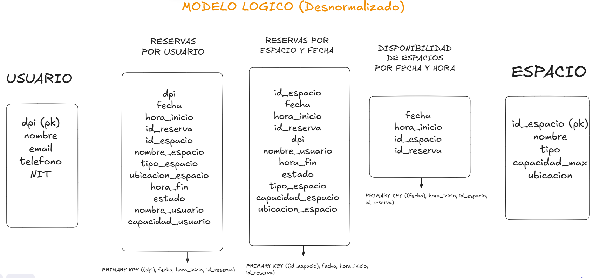

# 
  Proyecto #1 - Grupo 2 

## 
  Laboratorio Sistemas de Bases de Datos 2 - Sección A 

## 
  Primer Semestre 2025 
 
___

## Miembros

| Nombre | Carnet |
|:------:|:------:|
| Julio Alejandro Zaldaña Ríos | 202110206 |
| Edgar Mauricio Gómez Flores | 2011-14340 |
| Edgar Rolando Alvarez Rodriguez  | 202001144 |

______

## 
  Fases de Desarrollo 
 

### Modelo Conceptual (Entidad-Relación)

3 entidades principales:

1. Usuario
2. Reserva
3. Espacio

Se realizan las relaciones entre tablas, como un modelo relacional.

### Modelo Lógico

Se aplica desnormalización en el modelo anterior, para evitar:

* Evitar JOINS
* Normalización excesiva

1. **Usuario:**

DPI (pk)
nombre
email
telefono
NIT

2. **Reservas:**

id_reserva
DPI
id_espacio
nombre_espacio
nombre_usuario
fecha
hora_inicio
hora_fin
estado
tipo_espacio
capacidad_espacio
ubicacion_espacio

3. **Espacio:**

id_espacio (pk)
nombre
tipo
capacidad_max
ubicacion

### Modelo Físico

____

### Requerimientos Técnicos del Proyecto

